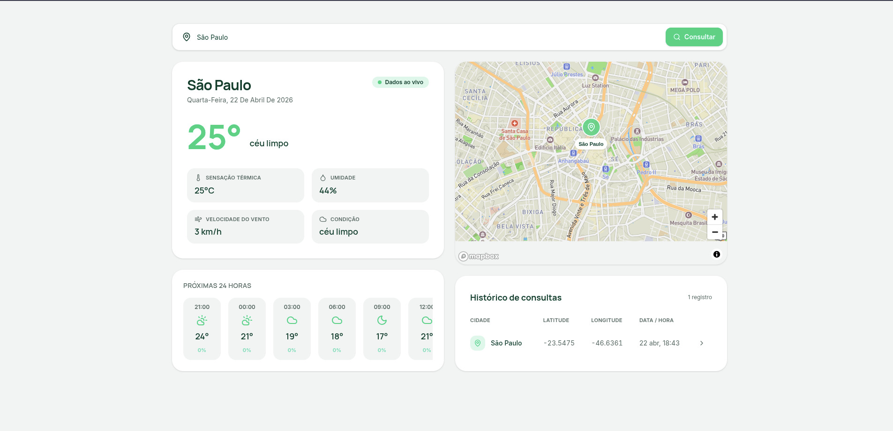

# Bemagro — Frontend

Aplicação web para consulta de previsão do tempo por cidade, com exibição da localização em mapa interativo e histórico das consultas realizadas.

## Deployment

Aplicação publicada na Vercel: **https://bem-agro-frontend.vercel.app/**

Repositório: **https://github.com/Anthony07M/bem-agro-frontend**

## Screenshot

<!-- Insira aqui o screenshot da tela desenvolvida -->



## Tecnologias

- **Next.js 16** (App Router) + **React 19**
- **TypeScript 5**
- **Tailwind CSS v4** — estilização utilitária
- **Mapbox GL** + **react-map-gl** — visualização do mapa interativo
- **lucide-react** — ícones
- **date-fns** — formatação de datas (locale pt-BR)
- **Jest** + **Testing Library** — testes unitários
- **Docker** (build multi-stage com saída `standalone` do Next.js)

## Pré-requisitos

- Node.js 20+
- npm 10+
- Docker (opcional, para execução em container)
- Token do Mapbox (https://account.mapbox.com/access-tokens/)
- Backend em execução (por padrão em `http://localhost:3001`)

## Como clonar e executar localmente

### 1. Clonar o repositório

```bash
git clone https://github.com/Anthony07M/bem-agro-frontend.git
cd bem-agro-frontend
```

### 2. Instalar as dependências

```bash
npm install
```

### 3. Configurar variáveis de ambiente

Copie o arquivo `.env.example` para `.env`:

```bash
cp .env.example .env
```

Abra o arquivo `.env` e preencha os valores:

```env
NEXT_PUBLIC_MAPBOX_TOKEN=seu_token_do_mapbox_aqui
NEXT_PUBLIC_API_URL=http://localhost:3001
```

| Variável | Descrição |
| --- | --- |
| `NEXT_PUBLIC_MAPBOX_TOKEN` | Access token do Mapbox usado pelo `MapViewer` |
| `NEXT_PUBLIC_API_URL` | URL base do backend (endpoints `/api/weather`, `/api/history`, `/api/forecast`) |

### 4. Rodar em modo desenvolvimento

```bash
npm run dev
```

Acesse http://localhost:3000.

### 5. Build de produção

```bash
npm run build
npm run start
```

## Scripts disponíveis

| Comando | Descrição |
| --- | --- |
| `npm run dev` | Inicia o servidor de desenvolvimento |
| `npm run build` | Gera o build de produção |
| `npm run start` | Sobe o servidor com o build de produção |
| `npm run lint` | Executa o ESLint |
| `npm test` | Executa os testes unitários |
| `npm run test:watch` | Executa os testes em modo watch |

## Executando com Docker

O projeto inclui um `Dockerfile` multi-stage que utiliza o output `standalone` do Next.js, resultando em uma imagem final enxuta.

### 1. Buildar a imagem

Na raiz do projeto frontend, execute:

```bash
docker build \
  --build-arg NEXT_PUBLIC_MAPBOX_TOKEN=seu_token_do_mapbox_aqui \
  --build-arg NEXT_PUBLIC_API_URL=http://localhost:3001 \
  -t bem-agro-frontend .
```

> As variáveis `NEXT_PUBLIC_*` precisam ser passadas como `--build-arg` pois o Next.js as resolve em tempo de build.

### 2. Rodar a imagem

```bash
docker run --rm -p 3000:3000 --name bem-agro-frontend bem-agro-frontend
```

Acesse http://localhost:3000.

Para rodar em background:

```bash
docker run -d -p 3000:3000 --name bem-agro-frontend bem-agro-frontend
```

Para parar e remover o container:

```bash
docker stop bem-agro-frontend
docker rm bem-agro-frontend
```

## Estrutura do projeto

```
frontend/
├── app/                  # Rotas e layout (Next.js App Router)
│   ├── globals.css       # Estilos globais e tokens Tailwind
│   ├── layout.tsx
│   └── page.tsx          # Página principal (orquestração de busca e estado)
├── components/           # Componentes de UI
│   ├── SearchInput.tsx
│   ├── WeatherCard.tsx
│   ├── HourlyForecastCard.tsx
│   ├── HistoryTable.tsx
│   └── MapViewer.tsx
├── lib/                  # Tipos e utilitários compartilhados
├── services/             # Integração com o backend (fetch)
├── public/               # Assets estáticos
├── Dockerfile
├── .env.example
└── package.json
```
